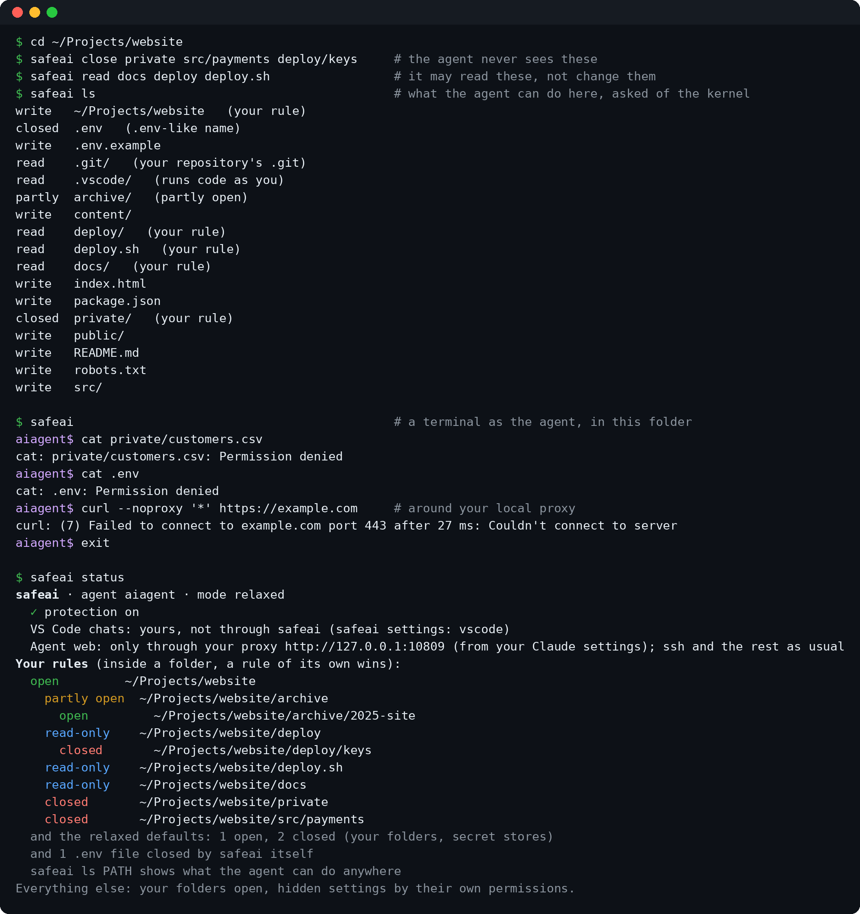
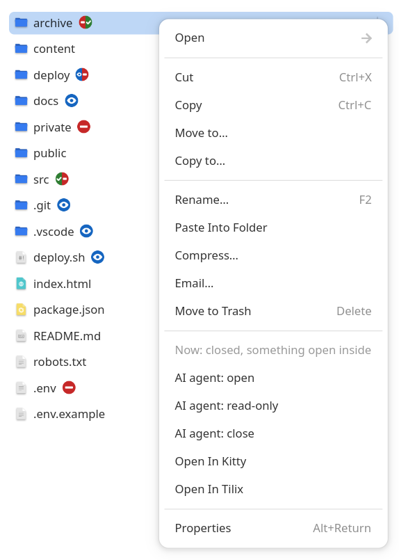
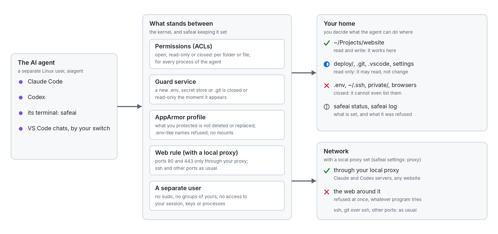

# linux-ai-agent-sandbox

**Guard rails, not a jail:** your AI agent keeps working in your real folders,
and the Linux kernel keeps it out of what you close.

Coding agents such as Claude Code or Codex often work with everything on your
computer. That is convenient, and it also means the agent can read or use files
you would rather keep to yourself, confidential ones included.

When an agent works under your own account, nothing can tell it apart from you.
It reads everything you can read; an encrypted folder is open to it as soon as
you unlock it; the "don't touch" rules in the agent's own settings do not bind
the scripts it runs. A line that holds has to come from the kernel: a sandbox
around each program the agent starts, or a separate user. This project takes
the second way, which covers everything the agent does (its terminal, VS Code
extensions, MCP servers) and lets it keep working in your real folders. It gives
the agent its own Linux account and short commands to decide, folder by folder,
what it may see and change.

You manage it from the terminal, from Files (Nautilus, the file manager of
Ubuntu) and from questions it shows on your screen.

> Status: early. Tested on fresh Ubuntu 24.04, Debian 12 and Arch Linux virtual
> machines. The depth of its protection was checked over several review rounds by
> Claude Opus 5.5 and Astra 6 (an independent Codex-based reviewer), and what they
> found was fixed, with tests. That is not a professional audit.
> [SECURITY.md](SECURITY.md) lists what it protects, what it does not, and how it
> was reviewed.

## Who it is for

People who work with an AI agent every day and mostly trust it, but want some
things kept out of its hands:

- **what it must not read:** personal documents, keys, passwords, `.env` files;
- **what it must not change:** your git settings and hooks, `~/.bashrc`, the
  configs of your editor and other agents - everything that later runs as you.

The agent keeps working in your real project folders, with its usual tools and
network access: no containers, no copies of your projects, nothing to mount. The
line holds whatever program the agent runs, which covers both its own mistakes
and instructions hidden in a web page or a README it happens to read.

It protects one person per computer: you, the owner who installs it. Other
accounts on the same machine get no protection from it and cannot install their
own; the installer says so when it finds them.

It is not a jail: whatever you leave open to the agent, it can send out, like
any program with network access, and the agents' own network sandboxes (such as
Claude Code's `/sandbox`) do not run inside safeai. Nor does it check the code the
agent writes: a test or script it changed runs as you when you run it. For code
you do not trust at all, or data that must never leave the machine, use a
virtual machine.

## In short

- The agent gets its own Linux user. It works in your real folders, but only
  where you allow it: the kernel checks every file access, whatever program the
  agent uses.
- For each folder or file you choose: **open** (the agent reads and writes),
  **read-only**, or **closed** (it cannot even see it); see
  [Rules inside folders](#rules-inside-folders).
- At install you choose what the agent gets wherever you set nothing; there is
  no preset answer. **strict**: the
  agent sees nothing in your home, and you open the project folders it should
  work in (`safeai claude` offers it the first time, VS Code asks on screen).
  **relaxed**: your folders are open, only what must never leak or change is
  protected (`.env` files, keys and passwords closed; settings and the places
  code runs from, like `~/.bashrc`, `~/bin`, `.git`, read-only - the agent still
  reads them, so an API key in `~/.bashrc` is visible to it), and you close what
  you want to keep from it.
- Your own `claude`, `codex` and VS Code keep working as you, exactly as before.
  The agent runs only where you ask for it: `safeai claude` (or `safeai codex`)
  starts it in the current folder; VS Code can be switched to it too.
- When the agent needs something closed to it, it asks you: the question shows
  on your screen, and one click allows it.
- Uninstall puts your system back as it was: `sudo /usr/local/lib/safeai/uninstall.sh`.
  Files the agent made in your projects stay, as yours.

## How it looks







## Install

```
git clone https://github.com/nezabudkinvo/linux-ai-agent-sandbox
cd linux-ai-agent-sandbox
git checkout v0.3.0     # the latest release; GitHub shows its tag as Verified (signed)
./install.sh            # questions, the plan, then sudo for exactly that plan
```

The installer runs as you: it asks for a language (English or Russian), the name
of the agent's user, strict or relaxed (no preset answer) and which options to
enable, and shows the plan in a few lines (`d` shows every change, file by file).
Only after your yes does it ask for sudo, to carry out that plan and nothing else.
It downloads nothing itself (missing packages come from your package manager).
The program itself is installed into `/usr/local` (owned by root, so nothing
running as you or as the agent can change it); the downloaded copy can be deleted
afterwards.

Run the full self-test: `/usr/local/lib/safeai/check.sh` (as yourself). It takes
about a minute and temporarily creates test folders and settings in your home;
it removes them before reporting `All checks passed`.

Interrupted? Ctrl+C during the install undoes what it had done. After anything
harder (a crash, a power cut), run `./install.sh` again to finish, or
`sudo ./uninstall.sh` from the same folder to remove what was begun.

Update: `safeai settings update` (or "update" in the `safeai settings` menu). It installs
only a newer release signed with the project's key, which your installation
recorded when you installed it; it shows who signed it and what changed, and asks
before it runs the installer with sudo. Your rules and answers stay. By hand,
in your clone: `git fetch --tags && git checkout vX.Y.Z`, read the changes, then
`sudo ./install.sh --update`.

Want to try it first without touching your system? `tests/vm.sh test ubuntu`
runs it in a throwaway virtual machine.

Remove: `sudo /usr/local/lib/safeai/uninstall.sh` - see
[What the installer changes](#what-the-installer-changes).

## Use

```
safeai claude [ARGS]            Claude as the agent, in this folder (offers to open it);
                                safeai codex, or any program, the same way
safeai                          a terminal as the agent, in this folder
safeai status                   protection, mode, every rule you set, who runs the chats
safeai settings                 settings in a menu: mode, VS Code, Files, proxy; "reset" drops
                                all your rules, "update" installs a newer signed release (both ask)
safeai ls [PATH]                what the agent can do with each entry here
safeai why PATH                 which rule decides that for one path, and how to change it
safeai open PATH...             the agent reads and writes
                                (asks y/N first for settings and places that run code as you)
safeai read PATH...             the agent reads, cannot change
safeai close PATH...            the agent can neither read nor enter
                                (on a folder these apply to everything in it; see below)
safeai check [--fix]            verify and repair (runs every 5 minutes)
safeai log [HOURS|all]          refused actions (with the audit option)
safeai log review [HOURS|all]   go through the places it was refused and open what it needs
```

Run the agent:

```
cd ~/Projects/website
safeai claude          # Claude as the agent (the first time it asks to open this folder)
```

`safeai codex` and any other program work the same way; `safeai` alone opens a
terminal as the agent (there `home` goes to your home folder, `cd` alone to the
agent's own). Start AI tools in a project folder, not in your home folder itself:
there they would take your own `~/.claude` and `~/.codex` for the project's
settings. The agent does not start while safeai's protection is
down (`safeai status` shows it).

The agent has its own copies of AI tools and signs in with its own account. The
first time you type `claude` (or `codex`, `gemini`) in the agent's terminal, it
shows the one command that installs it for the agent, no sudo needed. Tools
installed for the whole system work for the agent as they are. In VS Code
nothing needs installing: the extensions bring their own.

When the agent needs something it cannot reach, it asks you for that one path
with `safeai ask`. The question appears on your screen, with the path and the
agent's reason; you answer Allow, Read only or No, and the agent hears the answer
and goes on. If you are away, it asks in the chat with the exact command
(`safeai read PATH` or `safeai open PATH`). It never asks for secrets that way:
for those it asks you to make the change yourself. The installer gives it these
instructions (`~/.claude/CLAUDE.md` and `~/.codex/AGENTS.md` of the agent user),
and in Claude Code each refusal comes with a short note from safeai (a hook in
the agent's settings) saying what kind of place it is and what to ask for. You can
ask the same yourself: `safeai why PATH`; `safeai log review` goes through what it
was refused.

### Two kinds of chats

Most of your AI chats should be the agent's: everything that works on projects or
reads things from the web. A few need you: repairing the system, changing safeai
itself, editing what runs as you. Keep those few apart:

- in the terminal, plain `claude` is you, `safeai claude` is the agent;
- in VS Code, once you turn it on in `safeai settings`, Claude Code and Codex
  chats run as the agent. The status bar of each window shows who: "AI: agent".
  Click it for "AI: me": chats you start in that window from then on run as you,
  until you click again. A chat that already runs keeps its owner; Codex keeps
  one session per window, so VS Code offers to reload the window for it. Every
  reply begins with a one-line mark of whose chat it is. In the Explorer,
  right-click, "AI agent": open, read-only, close. `safeai settings set vscode
  off` puts VS Code back as it was;
- a chat as you does not start in a folder where the agent left Claude Code or
  Codex settings: you would run them as yourself;
- a chat you continue stays with whoever started it, whatever the switch says. The
  agent's chats appear in the VS Code chat list too;
- with a proxy set, the agent's Claude and Codex work only through it (see
  Network below);
- for the strongest separation, do not run your own chats and the agent's in the
  same folder. Keep a folder the agent cannot write for your own work (fixing the
  system, changing safeai, your rules for agents); a chat as you there cannot pick
  up anything the agent planted. A chat as you in a folder the agent can write
  still works, but reads what the agent left there - treat its results as untrusted.

Example: your shared instructions for AI agents live in `~/ai-rules`. Keep that
folder read-only to the agent (`safeai read ~/ai-rules`): agent chats follow the
rules but cannot change them; when one suggests a change, it writes it as a draft
in its project, you read the draft, and a chat as you applies it.

## Details

### Modes

For everything you did not set yourself (switch in `safeai settings`):

- `strict`: the agent sees nothing in your home (not even its
  list of files) until you open or allow reading something.
- `relaxed`: your folders are open, new ones too; hidden settings and program
  folders like `~/bin` are read-only, which means the agent reads them (keep no
  secrets in `~/.bashrc` and the like, or close them). Convenient, but everything
  you did not close (`~/Documents` too) is open to the agent.

In both modes:

- closed: known secret stores (`~/.ssh`, `~/.gnupg`, browser profiles, keyrings,
  cloud, git and package-registry credentials, other AI tools' logins) and every
  `.env`-like file, the moment it appears (also a store made after the install,
  such as a new `~/.aws`); `safeai read` or `open` on them asks first, default no;
- read-only even inside open folders, from the moment they appear (a new
  `git init` or `git clone` too): the whole `.git` of your repositories,
  `.vscode`, `.envrc`, `.claude`, `.codex`, `.mcp.json` - so the agent cannot
  plant code that you or your tools later run as yourself. `safeai open` on
  them asks first, default no. If the agent makes one where there was none (a
  new `.vscode` or `.claude` in your project), safeai moves it out within 5
  minutes to `~/.local/share/safeai-quarantine`; `safeai status` says so, and you
  decide whether to put it back. Claude Code running as the agent keeps its
  "don't ask again" answers in the project's `.claude`, so in your projects they
  do not last. The agent reads your repositories (`git status`, `log`, `diff`)
  but does not commit in them: you commit its changes. Its own repositories it
  keeps in its own home: with AppArmor it cannot create or move a `.git` anywhere
  in yours (without AppArmor, `safeai ls` and `safeai status` mark repositories
  it made; do not run your own git there). Its commits carry your git name and
  e-mail, which the installer gives it; to tell them apart, set its own in its
  terminal (`git config --global user.name ...`);
- files you made private yourself (mode 600/700) stay private, if your umask
  leaves new files readable to others (the usual 022 or 002). With a stricter
  umask (077) every file of yours is 600, so the mode tells nothing: safeai goes
  by names (secret stores, `.env`) and your rules, and you close secrets with
  `safeai close`;
- files the agent creates in open folders become yours.

### Network

Apart from a proxy you use (below), the agent's network is not restricted: it uses
the system's routing like any other program (the agents' own sandboxes, such as
Claude Code's `/sandbox`, do not run inside safeai: they need to mount file
systems, which safeai's AppArmor profile refuses). It shares `localhost` with you:
a dev server it starts opens in your browser as usual, and services you run
locally are reachable to it like to any user of the machine, so keep those behind
a password.

**A proxy.** If you send Claude through a proxy (`HTTPS_PROXY` in the `env` of
your `~/.claude/settings.json`), the agent works through it too. Or give one in
`safeai settings` (proxy, address) or with `safeai settings set proxy IP:PORT`:
one on this machine (`127.0.0.1:8080`) or in your network (`10.1.2.3:3128`), by
its IP address. `auto` takes the one from your Claude settings again, `off` turns
this off. Then:

- the agent's Claude and Codex get that proxy at every start (Claude above its
  own and the project's settings; in the agent's terminal, as it was when the
  terminal opened), and do not start while it does not answer;
- nothing of the agent starts while the kernel rule below is not in place;
- the kernel lets the agent reach the web (ports 80 and 443) only through the
  proxy (on this machine, or at its address), whatever program it runs: nothing goes around it by mistake (a program
  that ignores proxy settings, a proxy app that is down). It is not a wall against
  an agent set on getting out another way (see SECURITY.md, Known limits);
- ssh, git over ssh and every other port work as usual;
- only the proxy and certificate variables pass from your Claude settings; your
  sign-in, hooks and history stay yours.

`safeai status` shows the proxy in use.

### Rules inside folders

- What you do to a folder applies to everything in it. Close a folder, and
  everything inside is closed; open it, and everything inside is open, also what
  you had set differently there (the command lists what that changed).
- What you do to a file or a folder inside applies to it alone. Close one file in
  an open folder, and the folder stays open with that file closed.
- What you close or make read-only inside an open folder also cannot be deleted,
  renamed or replaced by the agent, nor the folders around it renamed; the rest of
  the folder works as usual. This needs AppArmor (see SECURITY.md); without it,
  keep such files in a read-only folder.
- Open something inside a closed folder, and that folder becomes **partly open**:
  the agent reaches only what you opened there; it cannot list the folder or add
  anything to it. Close what you opened, and the folder is closed again.
- Some things stay protected whatever you do to the folder around them: `.env`
  files and secret stores (closed), files private to you, mode 600 or 700 (closed;
  with the usual umask, see Modes),
  and in open folders `.git`, `.vscode`, `.claude` and other places that run code
  as you (read-only). Opening a folder says what stays protected in it; to give the
  agent one of these anyway, name it alone (`safeai open PATH`, which asks first).
- `safeai status` shows your rules as a tree; `safeai why PATH` says which rule
  decides one path.

### VS Code and Files

- VS Code, in `safeai settings`: the Claude Code and Codex extensions run as the
  agent (your own chats: the status bar switch). Opening a chat in a folder closed to the
  agent asks on screen whether to open the folder to it; it never runs as you
  instead. This switches only the AI processes: the window's terminal, tasks,
  debugger and other extensions stay yours, so a test the agent changed runs as
  you when you start it there. Off by default.
- Files (Nautilus): a right-click menu ("AI agent: open / read-only / close",
  under a greyed line with what the item is now) and emblems, see below. The
  installer offers it when Files is your default file manager; to add it later,
  install `nautilus` and `python3-nautilus` and run the installer again.

The emblems in Files show what the agent can do with each item. A two-color one
reads left to right: the folder itself, then something inside it.

| Emblem | Means |
|---|---|
|  | closed |
|  | read-only |
| (none) | the agent reads and writes |
|  | a closed folder; the agent reaches only what you opened inside |
|  | an open folder with something you closed inside, at any depth |
|  | a read-only folder with something you closed inside |

A `.env` that safeai closes by itself does not count for a folder's emblem: there
is one in almost every project, with its own red emblem.

### Requirements

Linux with systemd, a home folder on a filesystem with ACLs (ext4, btrfs, xfs),
Python 3.8+, sudo; apt, dnf or pacman to add missing packages. One owner per
computer: a second person cannot install it for themselves while it is installed.
A desktop is optional: on a server without one, everything but the on-screen
questions, Files and VS Code works from the terminal.

Optional:

- AppArmor, to refuse `.env` files to the agent at open time and to keep what you
  closed or made read-only from being deleted or replaced by it. It is on by
  default in Ubuntu, Debian and openSUSE; on Arch enable it first (see the Arch
  wiki, "AppArmor") and run the installer again. Without it the guard service
  closes new `.env` files right after they appear.
- nftables, for the proxy rule (installed when missing).
- auditd, for `safeai log`.
- nautilus-python, for the Files extension.

### What the installer changes

- It records every file, user, service and package it creates in
  `/var/lib/safeai/manifest` and backs up every existing file it changes.
- If a step fails, it reverts everything it did.
- The agent user has no password and does not appear on the login screen
  (AccountsService, used by GDM and LightDM, is told it is a system account).
- It changes no network settings of yours (routing, DNS, your firewall rules), no
  other users, your groups or your login. Its own nftables table `inet safeai`
  holds a rule only while you have a proxy set (see Network), and only for
  the agent user's web traffic. The only downloads are missing packages, from your
  package manager.
- `uninstall.sh` reverts the manifest: restores the backed-up files, removes what
  was created, removes the ACL entries it put on your files and gives your files
  back their permissions, deletes your safeai lists and what it moved out of
  your projects (the first question names it). It asks first whether to
  remove safeai completely (the agent user with its home, its logins and chat
  history, and the packages it installed too); answer n and it asks what to
  keep: your rules for a later install, the agent user, the packages. `--yes`
  removes everything without asking; `--keep-rules` and `--keep-agent` keep
  those (with your rules, what it moved out of your projects stays too). Ctrl+D
  at any question cancels. The copy you downloaded stays: it is yours, and the
  last line says where it is.
  Files the agent made in your folders stay, as yours.

Please read `install.sh` before you agree to its plan: every change it makes is
in the plan (`./install.sh --plan` prints all of it).

### How it works

- `bin/safeai` - the command; runs as you and changes ACLs on your own files.
- `libexec/safeai-guard` - a small root service (fanotify): hands the agent's
  new files to you, closes new `.env` files at once, applies the mode to new
  folders in your home.
- `libexec/safeai-run` - starts a program as the agent with a clean environment
  (no tokens, no session sockets), inside the AppArmor profile. For VS Code it
  first decides who runs the chat (the agent, or you as the status bar switch says).
  Agent Claude and Codex also get your proxy (see Network).
- `libexec/safeai-keep` - a root service with AppArmor rules only: what you
  closed or made read-only (and the folders around it) cannot be deleted,
  renamed or replaced by the agent.
- `libexec/safeai-web` - a root service with network rules only: with a local
  proxy set, the agent's web goes only through it (nftables table `inet safeai`).
- `safeai-ask.socket` - the agent's questions (`safeai ask`), answered on your
  screen by a service that runs as you.
- `share/vscode` - the VS Code extension: the status bar switch and the Explorer
  menu; it calls `safeai`, and keeps no state of its own.
- `libexec/safeai-shell` - the agent's login shell: everything it starts runs
  inside the profile.
- `share/apparmor/safeai-agent.in` - the profile: everything is allowed except
  secret-looking file names outside `/tmp`, mounts, profile changes and, from
  safeai-keep, removing or replacing what your lists protect.
- A systemd timer runs `safeai check --fix` every 5 minutes.

### Testing

`tests/vm.sh test ubuntu [strict|relaxed]` (also `debian`, `arch`) boots a
throwaway virtual machine (QEMU/KVM, no root needed), installs this checkout and
runs the checks there. `tests/vm.sh clean ubuntu` installs, uses and removes
safeai, then compares the machine with how it was before; `tests/vm.sh upgrade
ubuntu` installs the last release and updates it with this checkout.

## Acknowledgements

Thanks to Claude (Anthropic): Claude Code with Claude Opus helped compare existing
approaches, design, write and test this project, and review its security in
several rounds; and to Astra 6, the Codex-based reviewer whose independent audits
found real bugs here.

## License

MIT, see [LICENSE](LICENSE).
